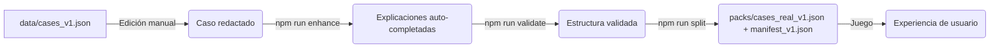
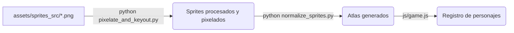

# Guía de Desarrollo: Casos LaSalle

Esta guía describe el flujo de trabajo para crear nuevos casos clínicos, añadir arte (personajes/sprites) y mantener la aplicación en general. **Toda la arquitectura actual está enfocada 100% en el nivel de Licenciatura (Pregrado).**

---

## 1. Pipeline de Casos Clínicos

El flujo de trabajo para agregar o modificar casos en el juego es el siguiente:



### Comandos Clave

```bash
# 1. Añadir/editar casos manualmente en data/cases_v1.json
# (No hay script para agregar casos, se hace copiando y pegando la estructura de uno existente en el JSON)

# 2. Completar explicaciones vacías con IA
npm run enhance

# 3. Validar estructura de todos los casos
npm run validate

# 4. Generar packs y manifiesto para el juego
npm run split
```

### Buenas Prácticas al Crear un Caso
1. **Siempre incluir `display_title`** (se usa en la interfaz).
2. **Mantener `educational_level` en `"licenciatura"`** para todos los casos nuevos.
3. **No incluir RDoC/HiTOP** en las preguntas ni explicaciones (fueron eliminados para no distraer).
4. **Asegurar que `tasks` tenga al menos una pregunta** y que `expected_answer` esté en los distractores o en una opción correcta.
5. **Validar con `npm run validate`** antes de hacer commit.

---

## 2. Pipeline de Arte y Personajes

El sistema de personajes utiliza sprites al estilo retro. El proceso para crear un nuevo personaje a partir de fotos originales es:



### Comandos Clave

```bash
# 1. Colocar fotos originales (con fondo verde u homogéneo) en assets/sprites_src/

# 2. Procesar imágenes (remover fondo verde + pixelar)
python tools/pixelate_and_keyout.py

# 3. Normalizar y generar atlas (cuadricula 5x2)
python tools/normalize_sprites.py

# 4. Registrar en js/game.js (definir el nuevo personaje en el objeto Avatars)
```

> **Nota:** Las hojas de sprites (Atlas) deben ser una rejilla de **5 columnas × 2 filas** (10 poses). El orden esperado por el CSS y JS es:
> - Fila 1: `normal`, `speaking`, `thinking`, `ok`, `streak`
> - Fila 2: `worried`, `shock`, `exhausted`, `surprised`, `angry`

---

## 3. Estructura de Archivos Esperada

```bash
data/
├── cases_v1.json           # Fuente de verdad: editar aquí los casos
├── manifest_v1.json        # Generado por splitPacks.js
└── packs/
    └── cases_real_v1.json  # Generado por splitPacks.js (Cargado por el juego)

tools/
├── enhanceCases.js         # Auto-completa explicaciones (LLM)
├── validate_cases.js       # Valida estructura de datos
├── splitPacks.js           # Genera manifest + packs
├── pixelate_and_keyout.py  # Procesa imágenes (Quita fondos y pixela)
└── normalize_sprites.py    # Genera atlas listos para web

assets/
├── sprites_src/            # Imágenes originales (input)
└── sprites/                # Sprites procesados (output de los scripts python)

js/
└── game.js                 # Lógica principal del juego e interfaz
```

## 4. Dinámica de Juego (Ajuste Fino)

Toda la economía de la partida vive en `GAME_CONFIG` (`js/game.js`). Cambiar un
número ahí reequilibra el juego entero sin tocar la lógica.

| Parámetro | Qué controla |
|---|---|
| `baseReward` / `baseXP` | Pago fijo por acierto, antes de bonos |
| `speedBonusMax` | Monedas extra si respondes con el reloj intacto (escala con el tiempo sobrante) |
| `fastThreshold` | Fracción de reloj restante a partir de la cual cuenta como "reflejo clínico" |
| `streakStep` / `maxMultiplier` | Cada cuántos aciertos sube el multiplicador y hasta dónde |
| `signFine` | Multa por firmar una nota equivocada |
| `casesPerRound` | Pacientes por bloque antes del pase de visita |

### Las cuatro capas de recompensa

1. **Base**: `baseReward` por acierto.
2. **Rapidez**: proporcional al reloj que sobra. El tiempo dejó de ser sólo una
   amenaza; ahora también paga.
3. **Multiplicador de racha**: sube medio punto cada `streakStep` aciertos
   seguidos. Se muestra en el HUD como el multiplicador que cobrará el
   *próximo* acierto, no el ya cobrado.
4. **Firma de la nota**: apuesta opcional por pregunta (tecla `F`). Dobla la
   recompensa si aciertas y cobra `signFine` si no. Se desactiva sola en modo
   estudio y en documentos educativos.

Fórmula: `monedas = round((baseReward + bonoRapidez) × multiplicador) × (firmada ? 2 : 1)`

### Pase de visita

Cada `casesPerRound` pacientes resueltos, `showRoundReview()` interrumpe la
guardia con la evaluación del Dr. Celada. El nivel sale de `BOSS_ROUNDS`, una
tabla ordenada por proporción de aciertos del bloque: cada entrada define
`min` (umbral), `bonus`, si devuelve una vida (`heal`) y el repertorio de
frases. Para añadir un nivel, insértalo respetando el orden descendente de
`min`.

Un pase impecable es la única forma de recuperar una vida sin pagar monedas.

### Logros

Se definen en `ACHIEVEMENTS` (`js/economy.js`). Cada uno es un objeto con
`icon`, `name`, `desc` y una `condition(d)` que lee el estado persistido. Los
contadores que alimentan esas condiciones se actualizan desde
`Economy.recordAnswer()`, `Economy.recordRound()` y `Economy.registerGame()`.
Añadir un logro es añadir una entrada: la vitrina del menú y los avisos
emergentes lo recogen solos.

> **Compatibilidad de guardados:** la clave de `localStorage` sigue siendo
> `psy_miami_save_v2`. Los campos nuevos se rellenan con cero al cargar una
> partida vieja, así que nadie pierde monedas ni logros al actualizar.

---

## 5. Lenguaje Visual

El CSS trabaja sobre una escala corta de variables (`assets/styles.css`, bloque
`:root`). Usa los tokens antes de inventar un valor nuevo: es lo único que
sostiene la coherencia de un archivo de dos mil líneas.

| Token | Uso |
|---|---|
| `--ink-1` / `--ink-2` / `--ink-3` | Texto principal, secundario y de etiqueta |
| `--line` / `--line-strong` | Bordes de reposo y de control interactivo |
| `--surface-1` / `--surface-2` | Fondo de control y su estado hover |
| `--r-sm` / `--r-md` / `--r-lg` | Radio de control, panel y tarjeta |
| `--miami-cyan` / `--miami-pink` / `--gold` | Acentos con significado fijo |

**Los acentos no son decoración, son semántica.** El cian marca el tiempo y la
acción principal; el magenta, la racha y la firma; el oro, las monedas; el
verde y el rojo, acierto y error. Un elemento que no sea ninguna de esas cosas
va en la escala de tinta. Cuando todo brillaba por igual, nada destacaba.

### Retratos

El fondo de cada retrato es una clase, no un degradado en línea, y dice el
papel de quien aparece:

| Clase | Quién | Color |
|---|---|---|
| `kawaii-avatar--resident` | El residente que te presenta el caso | Cian frío |
| `kawaii-avatar--boss` | El Dr. Celada | Magenta |
| `kawaii-avatar--patient` | Paciente estable | Neutro |
| `kawaii-avatar--patient-tachy` | Paciente acelerado | Rojo |
| `kawaii-avatar--patient-brady` | Paciente hipoactivo | Azul frío |

El tono del paciente lo decide `getPatientEcgClass()`, el mismo que colorea la
traza del monitor: retrato y ECG nunca se contradicen. Para añadir un
residente basta con su sprite y su firma en `ROSTER` — ya no hay que inventarle
un color, porque su cara y su nombre son lo que lo distingue.

### Reglas de jerarquía

- **La pregunta es el elemento más grande y brillante de la pantalla.** El
  título del caso es una etiqueta de expediente y va en `--ink-2`.
- **El HUD es un panel fijo y opaco.** Tiene que tapar el caso que corre por
  debajo, no dejarlo entrever: nada de fondos translúcidos ahí.
- **Las ayudas de pago y los ajustes no pesan igual.** Comprar una vida es una
  decisión; silenciar el sonido es una preferencia, y va como icono.

---

## 6. Scripts de Utilidad (Package.json)
- `npm run validate` → `node tools/validate_cases.js data/cases_v1.json data/cases_v1_validated.json`
- `npm run validate:packs` → `node tools/validateAllPacks.js ./data/manifest_v1.json`
- `npm run enhance` → `node tools/enhanceCases.js data/cases_v1_validated.json data/cases_v1.json`
- `npm run split` → `node tools/splitPacks.js`
