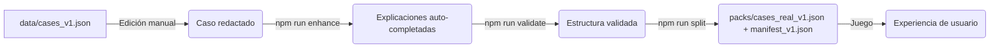
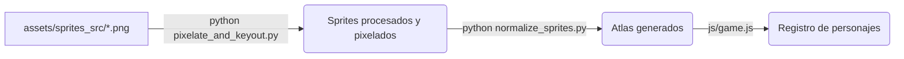

# Guía de Desarrollo: Casos LaSalle

Esta guía describe el flujo de trabajo para crear nuevos casos clínicos, añadir arte (personajes/sprites) y mantener la aplicación en general. **Toda la arquitectura actual está enfocada 100% en el nivel de Licenciatura (Pregrado).**

---

## 1. Pipeline de Casos Clínicos

El flujo de trabajo para agregar o modificar casos en el juego es el siguiente:



### Comandos Clave

```bash
# 1. Añadir/editar casos manualmente en data/cases_v1.json
# (No hay script para agregar casos, se hace copiando y pegando la estructura de uno existente en el JSON)

# 2. Completar explicaciones vacías con IA
npm run enhance

# 3. Validar estructura de todos los casos
npm run validate

# 4. Generar packs y manifiesto para el juego
npm run split
```

### Buenas Prácticas al Crear un Caso
1. **Siempre incluir `display_title`** (se usa en la interfaz).
2. **Mantener `educational_level` en `"licenciatura"`** para todos los casos nuevos.
3. **No incluir RDoC/HiTOP** en las preguntas ni explicaciones (fueron eliminados para no distraer).
4. **Asegurar que `tasks` tenga al menos una pregunta** y que `expected_answer` esté en los distractores o en una opción correcta.
5. **Validar con `npm run validate`** antes de hacer commit.

---

## 2. Pipeline de Arte y Personajes

El sistema de personajes utiliza sprites al estilo retro. El proceso para crear un nuevo personaje a partir de fotos originales es:



### Comandos Clave

```bash
# 1. Colocar fotos originales (con fondo verde u homogéneo) en assets/sprites_src/

# 2. Procesar imágenes (remover fondo verde + pixelar)
python tools/pixelate_and_keyout.py

# 3. Normalizar y generar atlas (cuadricula 5x2)
python tools/normalize_sprites.py

# 4. Registrar en js/game.js (definir el nuevo personaje en el objeto Avatars)
```

> **Nota:** Las hojas de sprites (Atlas) deben ser una rejilla de **5 columnas × 2 filas** (10 poses). El orden esperado por el CSS y JS es:
> - Fila 1: `normal`, `speaking`, `thinking`, `ok`, `streak`
> - Fila 2: `worried`, `shock`, `exhausted`, `surprised`, `angry`

---

## 3. Estructura de Archivos Esperada

```bash
data/
├── cases_v1.json           # Fuente de verdad: editar aquí los casos
├── manifest_v1.json        # Generado por splitPacks.js
└── packs/
    └── cases_real_v1.json  # Generado por splitPacks.js (Cargado por el juego)

tools/
├── enhanceCases.js         # Auto-completa explicaciones (LLM)
├── validate_cases.js       # Valida estructura de datos
├── splitPacks.js           # Genera manifest + packs
├── pixelate_and_keyout.py  # Procesa imágenes (Quita fondos y pixela)
└── normalize_sprites.py    # Genera atlas listos para web

assets/
├── sprites_src/            # Imágenes originales (input)
└── sprites/                # Sprites procesados (output de los scripts python)

js/
└── game.js                 # Lógica principal del juego e interfaz
```

## 4. Scripts de Utilidad (Package.json)
- `npm run validate` → `node tools/validate_cases.js data/cases_v1.json data/cases_v1_validated.json`
- `npm run validate:packs` → `node tools/validateAllPacks.js ./data/manifest_v1.json`
- `npm run enhance` → `node tools/enhanceCases.js data/cases_v1_validated.json data/cases_v1.json`
- `npm run split` → `node tools/splitPacks.js`
